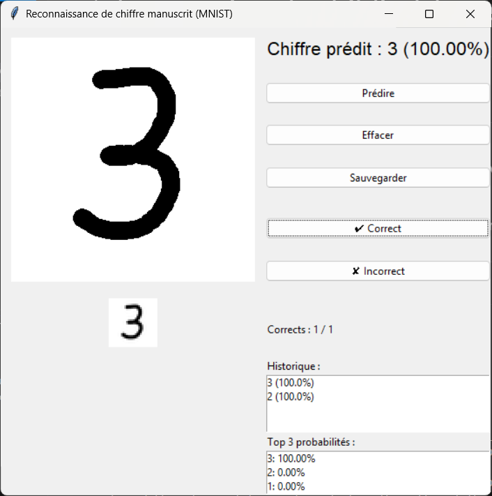

# 🧠 Application de Reconnaissance de Chiffres Manuscrits (MNIST)

Cette application permet de dessiner des chiffres à la main et d'utiliser un modèle pré-entraîné (basé sur MNIST) pour les reconnaître automatiquement. Elle propose également des fonctionnalités enrichies pour l'interaction utilisateur et l'analyse des résultats.

## ✨ Fonctionnalités

- 🎨 Interface graphique intuitive avec Tkinter
- ✍️ Dessin libre avec pinceau et gomme
- 🔢 Prédiction du chiffre manuscrit
- 📊 Affichage des probabilités de chaque chiffre (0-9)
- 🧾 Historique des prédictions
- 💾 Sauvegarde des dessins



⚙️ Prérequis

- Python **3.12.7**
- Modules requis (voir ci-dessous)

## 📦 Installation

1. Clone le dépôt :

```bash
git clone https://github.com/kamalC73/number-classification.git
cd number-classification 
```

2. Crée un environnement virtuel (optionnel mais recommandé) :

```bash
python -m venv venv
source venv/bin/activate  # Linux/macOS
venv\Scripts\activate     # Windows
```

4. Installe les dépendances :

```bash
pip install -r requirements.txt
```

## ✅ Fichier `requirements.txt` (minimal)

```txt
tensorflow==2.19.0
numpy==2.1.3
pillow==11.2.1
matplotlib==3.10.1
ipywidgets==8.1.7
ipykernel==6.29.5
jupyterlab-widgets==3.0.15
```

## 🚀 Lancer l'application

```bash
python app.py
```

Remplace `app.py` par le nom réel de ton fichier principal.

## 📂 Arborescence du projet (exemple)

```
📁 numbers classification/
├── static/
│   └── demo.png
│   └── mnist_model.keras
├── training.ipynb
├── README.md
├── requirements
└── main.py
```
